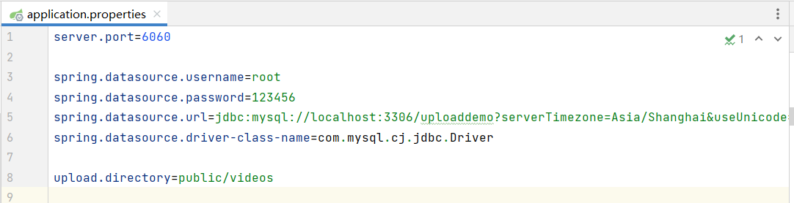
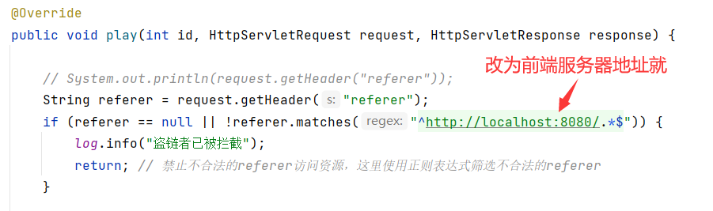

# video-demo-backend

## 说明

本开源代码是我在做弹幕视频网站过程中的练手项目，所以很多功能都没写全，只写了关键部分，本仓库只是demo的后端部分，需要与前端代码结合来看，前端代码请移步：[分片上传以及流式播放的简单示例前端（vue3）](https://github.com/xunlu129/video-demo-frontend)

## 技术栈

开发语言：java8

使用架构：三层架构，springboot2.7.15 + mybatis-plus

数据库：MySQL8.0

## 数据库

自行创建一个数据库，生成以下表：

```sql
create table video
(
    id  int auto_increment
        primary key,
    url varchar(500) not null,
    constraint id
        unique (id),
    constraint url
        unique (url)
);
```

## 其他

配置文件自行修改

我这端口开在了 `6060`，上传文件存放地址为项目地址的 `public/video`



- 为了防止盗链盗资源等情况，我在播放请求接口逻辑里设置了指定请求有效referer

可以自行根据前端地址更改



有能力的也可以用 `Nginx` 技术进行防盗链
